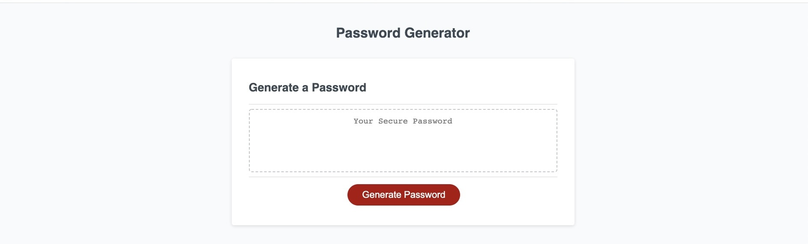
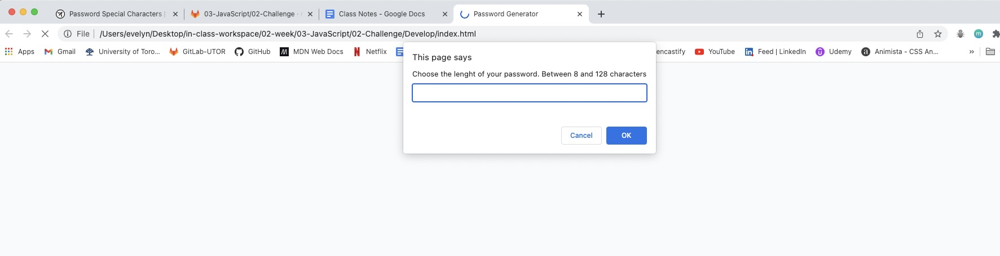
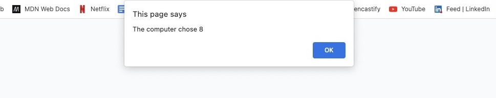
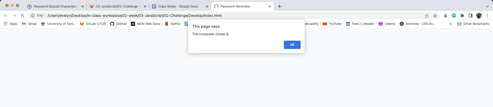

# Javascript - Password generator

## Description

The goal of the project was to generate random passwords based on criteria that the user have selected. This app will run in the browser and will feature dynamically updated HTML and CSS powered by JavaScript code. It will have a clean and polished, responsive user interface.

- Includes prompted for the length of the password.
- Includes prompted asked for character types to include in the password, whether or not to include lowercase, uppercase, numeric, and/or special characters.
- When each prompt was answer, then my input should be validated and at least one character type should be selected.
- When all prompts are answered, a password is generated.

## Deployed app

https://evelyntorress.github.io/fantastic-lamp/

## Mock up

